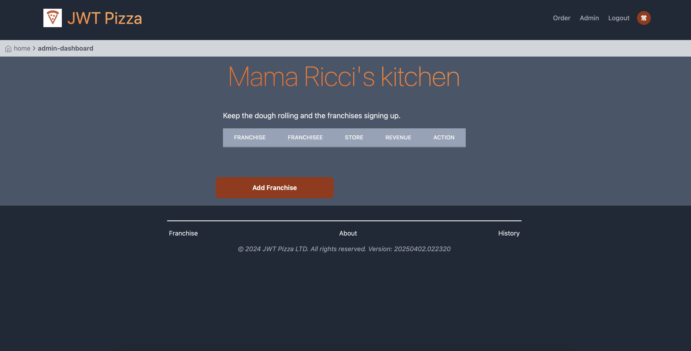
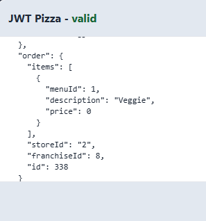
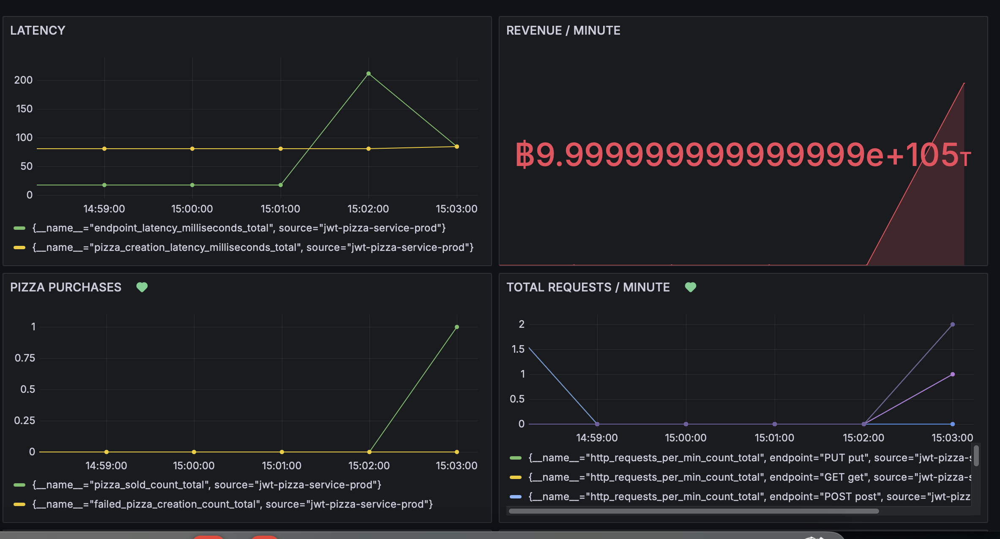

# Penetration Testing - Quenton Barger and Blaine Van Item

### Solo attack

1. Remove franchises
   
| Item           | Result                                                                         |
| -------------- | ------------------------------------------------------------------------------ |
| Date           | April 15, 2025                                                                 |
| Target         | pizza.sobolo.click                                                       |
| Classification | Security Misconfiguration                                                                      |
| Severity       | 1                                                                              |
| Description    | Admin account breached. All franchises deleted through the franchise endpoint.                |
| Images         |    Stores no longer accessible. |
| Corrections    | More secure admin password, or regular changing of the password.                                                          |

2. Change admin password

| Item           | Result                                                                         |
| -------------- | ------------------------------------------------------------------------------ |
| Date           | April 15, 2025                                                                 |
| Target         | pizza.sobolo.click                                                       |
| Classification | Identification and Authentication Failures                                                                      |
| Severity       | 3                                                                              |
| Description    | Admin account breached. Admin password changed without admin knowledge.                |
| Images         |    Admin cannot login. |
| Corrections    | More secure admin account.                                                          |

3. Change role
   
| Item           | Result                                                                         |
| -------------- | ------------------------------------------------------------------------------ |
| Date           | April 15, 2025                                                                  |
| Target         | pizza.sobolo.click                                                       |
| Classification | Security Misconfiguration                                                                      |
| Severity       | 3                                                                              |
| Description    | All franchisee's account roles removed. All franchisees became diners.                |
| Images         |    No longer a franchisee. |
| Corrections    | Secure admin account. Attack came from the same breach.                                                          |

---

### Peer attack

1. Remove franchises (Quenton attacks Blaine)

| Item           | Result                                                                         |
| -------------- | ------------------------------------------------------------------------------ |
| Date           | April 15, 2025                                                                 |
| Target         | pizza.bvanitem.com                                                       |
| Classification | Security Misconfiguration                                                                      |
| Severity       | 1                                                                              |
| Description    | Admin account breached. All franchises deleted through the franchise endpoint.                |
| Images         |    Code removing franchises. |
| Corrections    | More secure admin password, or regular changing of the password.                                                          |

2. Change pizza price (Blaine attacks Quenton)

| Item           | Result                                                                         |
| -------------- | ------------------------------------------------------------------------------ |
| Date           | April 15, 2025                                                                 |
| Target         | pizza.sobolo.click                                                       |
| Classification | Insecure Design                                                                      |
| Severity       | 2                                                                             |
| Description    | Order request intercepted. Price changed on outgoing request to factory.                |
| Images         |    No profit from sales.       Inaccurate income.         |
| Corrections    | Store prices in factory so that data is not open to the public.                |

---

### Summary

   We learned that maintaining security for any administrative measures is critical. My attacks were only possible by an intruder attack through the login request using Burp Suite. It causes major problems when an administrative account is hacked, but it is pretty easy to protect that.
   We also learned that it is important to keep data private and confined. If a request for an order is intercepted, it is free to have the type of pizza, amount of pizza, price, or location changed. It is very crucial to sanitize or prevent access to data. Especially when the value of the pizza is digital.
