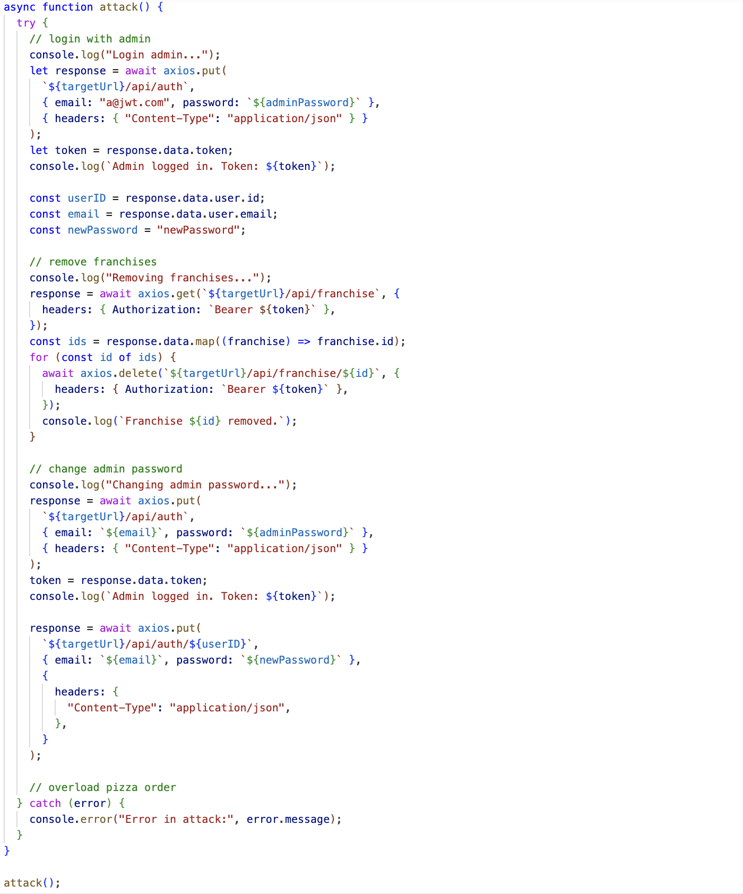
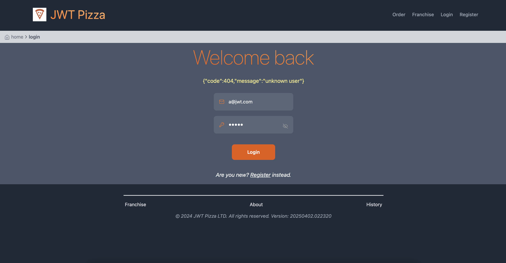
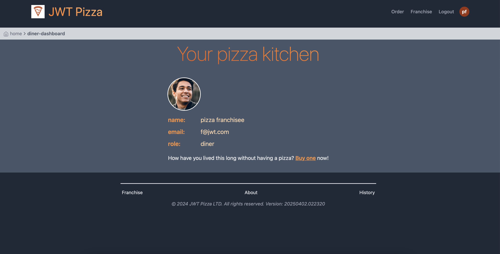

# Penetration Testing - Quenton Barger and Blaine Van Item

### Solo attack

1. Remove franchises
   
| Item           | Result                                                                         |
| -------------- | ------------------------------------------------------------------------------ |
| Date           | April 15, 2025                                                                 |
| Target         | pizza.sobolo.click                                                       |
| Classification | Security Misconfiguration                                                                      |
| Severity       | 1                                                                              |
| Description    | Admin account breached. All franchises deleted through the franchise endpoint.                |
| Images         |    Stores no longer accessible. |
| Corrections    | More secure admin password, or regular changing of the password.                                                          |

2. Change admin password

| Item           | Result                                                                         |
| -------------- | ------------------------------------------------------------------------------ |
| Date           | April 15, 2025                                                                 |
| Target         | pizza.sobolo.click                                                       |
| Classification | Identification and Authentication Failures                                                                      |
| Severity       | 3                                                                              |
| Description    | Admin account breached. Admin password changed without admin knowledge.                |
| Images         |    Admin cannot login. |
| Corrections    | More secure admin account.                                                          |

3. Change role
   
| Item           | Result                                                                         |
| -------------- | ------------------------------------------------------------------------------ |
| Date           | April 15, 2025                                                                  |
| Target         | pizza.sobolo.click                                                       |
| Classification | Security Misconfiguration                                                                      |
| Severity       | 3                                                                              |
| Description    | All franchisee's account roles removed. All franchisees became diners.                |
| Images         |    No longer a franchisee. |
| Corrections    | Secure admin account. Attack came from the same breach.                                                          |

---

### Peer attack

